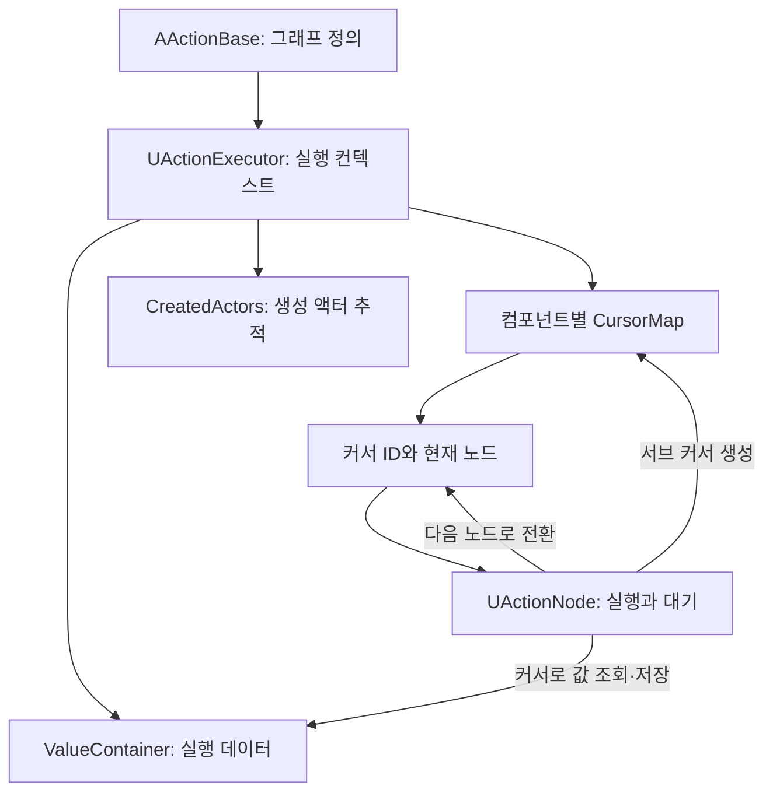
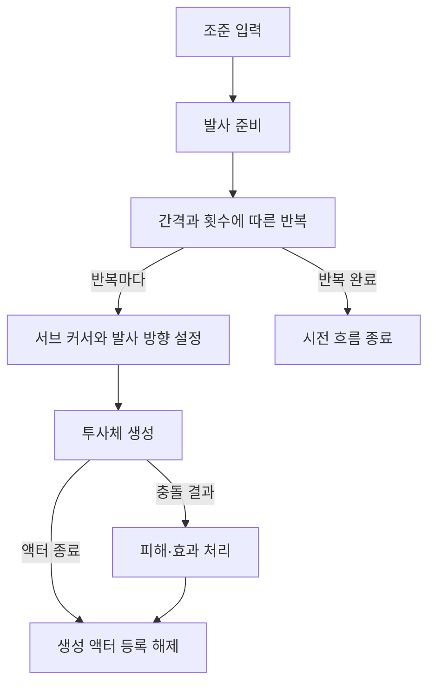

# White-Clad Warriors

**Unreal Engine 5.6 · C++ / Blueprint · 커서 기반 액션 그래프**

White-Clad Warriors(WCW)는 영웅 조작과 마을 운영을 결합하는 RTS × RPG 개인 개발 프로젝트입니다. 현재는 본게임의 진행과 콘텐츠를 확장하기 위한 기반을 만드는 단계이며, 이 저장소의 주요 탐색 대상은 **행동을 노드로 조립하고, 실행 중인 커서를 통해 이어 가는 액션 그래프 시스템**입니다.

액션은 입력 선택, 이동, 방향 전환, 몽타주, 지연, 반복, 투사체 생성, 피해 처리 등을 연결해 구성합니다. C++은 실행 컨텍스트와 전환 규약을 제공하고, Blueprint는 구체적인 노드 동작과 액션 프리셋을 구성합니다. 새 액션을 만들 때 이미 있는 동작과 값 조회 규칙을 재사용하고, 필요한 기능만 노드 단위로 추가하는 것이 설계의 중심입니다.

## 빠르게 살펴보기

- **설계부터 읽기:** [액션 그래프의 구성](#액션-그래프의-구성) → [커서를 보유하는 노드](#커서를-보유하는-노드) → [값의 범위와 Claimer](#값의-범위와-claimer)
- **코드부터 읽기:** [주요 코드 탐색 경로](#주요-코드-탐색-경로)의 순서대로 정의·실행기·노드·값 저장소 확인
- **Unreal Editor에서 보기:** [Blueprint 노드와 프리셋](#blueprint-노드와-프리셋)의 `BP_Action_Move`, `BP_Action_BasicAttack`, `BP_Action_FireBall`
- **응용 범위 살펴보기:** [조합으로 달라지는 액션](#조합으로-달라지는-액션)과 [확장 가능성](#확장-가능성)
- **프로젝트 열기:** [실행 환경](#실행-환경)

## 프로젝트와 현재 범위

게임의 목표는 영웅의 성장과 마을 운영을 병행하며 마왕 처치를 겨루는 플레이입니다. 이 README는 그 기획 전체를 구현 완료 목록으로 소개하지 않고, 현재 저장소에서 확인할 수 있는 액션 기반에 집중합니다.

| 구분 | 현재 저장소에서 살펴볼 내용 |
| --- | --- |
| 액션 실행 기반 | 노드 연결, 커서 관리, 입력 전달, 완료·취소·진입 거부 처리, 서브 커서 생성 |
| 실행 데이터 | 실행기 내부의 계층형 값 저장소, 위치·방향·대상을 계산하는 Claimer |
| 콘텐츠 조립 | 이동·공격·대시·투사체 계열 Blueprint 프리셋과 지연·반복·동시 실행 노드 |
| 게임 연결 | 유닛 행동 컴포넌트, 공격 실행, 몽타주 메시지, 입력 인디케이터, 실행기와 표시 액터의 풀링 |
| 주변 기반 | 유닛 선택·명령 예약, UI, 값 컨테이너, 인벤토리 관련 코드 |
| 본게임 콘텐츠 | 마을 운영, 성장·경제, 한 판의 진행과 승리 조건 등은 개발 목표이며 완성된 플레이 루프로 소개하지 않음 |

여기서 **액션 그래프**는 Blueprint에서 생성·연결하는 `UObject` 노드들의 실행 구조를 뜻합니다. 노드 객체를 명령, 커서를 실행 위치, 실행기를 컨텍스트로 보면 객체 기반 인터프리터의 관점으로도 읽을 수 있습니다. 별도의 바이트코드 형식이나 범용 VM을 제공하는 프로젝트라는 의미는 아닙니다.

## 주요 코드 탐색 경로

아래 순서는 액션 하나가 시작되어 실행되고 종료되는 과정을 따라갑니다. 공개 API는 `Public`, 실제 전환 로직은 `Private`에 있습니다.

| 순서 | 파일 | 확인할 지점 |
| --- | --- | --- |
| 1 | [ActionBase.h](Source/WhiteCladWarriors/Public/Actions/ActionBase.h), [ActionBase.cpp](Source/WhiteCladWarriors/Private/Actions/ActionBase.cpp) | 액션 정의, `RootNode` / `RootAsSubNode`, `ExecuteAction*` 진입점 |
| 2 | [ActionStructures.h](Source/WhiteCladWarriors/Public/Generals/Structs/ActionStructures.h) | `FActionCursorFinder`, `FActionExecuteSettingContainer`, `FMainActionInfo` |
| 3 | [ActionExecutor.h](Source/WhiteCladWarriors/Public/Actions/Executables/ActionExecutor.h), [ActionExecutor.cpp](Source/WhiteCladWarriors/Private/Actions/Executables/ActionExecutor.cpp) | `CursorMap`, `EnterNode`, `CreateSubNode`, `EndNode`, `CheckCursorMap` |
| 4 | [ActionNode.h](Source/WhiteCladWarriors/Public/Actions/Executables/ActionNode.h), [ActionNode.cpp](Source/WhiteCladWarriors/Private/Actions/Executables/ActionNode.cpp) | 노드의 실행·전환·메시지 규약 |
| 5 | [ActionValueContainer.h](Source/WhiteCladWarriors/Public/Generals/Structs/ActionValueContainer.h), [ActionValueContainer.cpp](Source/WhiteCladWarriors/Private/Generals/ActionValueContainer.cpp) | 실행 데이터의 저장과 부모 범위 조회 |
| 6 | [ActionValueClaimer.h](Source/WhiteCladWarriors/Public/Actions/Values/ActionValueClaimer.h), [ActionValueClaimer.cpp](Source/WhiteCladWarriors/Private/Actions/Values/ActionValueClaimer.cpp) | 위치·방향·대상·거리의 계산과 재사용 |
| 7 | [Blueprint 프리셋](Content/1_Core/Blueprints/Actions/Presets) | 위의 C++ 규약으로 실제 콘텐츠를 구성하는 부분 |

입력에서 진입하는 과정을 보려면 [Operator.cpp](Source/WhiteCladWarriors/Private/Objects/Players/Operator.cpp)의 `CommandAction`을, 유닛의 공격이 다른 액션을 호출하는 과정을 보려면 [UnitAttackComponent.cpp](Source/WhiteCladWarriors/Private/Objects/Selectables/Components/UnitAttackComponent.cpp)의 `ExecuteAttack_Implementation`을 이어서 읽으면 됩니다.

## 액션 그래프의 구성

| 구성 요소 | 역할 |
| --- | --- |
| `AActionBase` | 액션 이름·아이콘·단축키 등의 정보와 그래프 진입점을 보유합니다. |
| `UActionNode` | 한 단계의 실행과 다음 연결을 정의합니다. 실제 동작은 C++ 또는 Blueprint 파생 노드에서 구현합니다. |
| `UActionExecutor` | 한 번의 액션 실행에 필요한 커서, 값 저장소, 생성 액터 목록을 관리합니다. |
| `FActionCursorFinder` | 어느 실행기의 어느 컴포넌트에서 어떤 실행 흐름을 찾을지 식별합니다. 마우스 커서와는 다른 개념입니다. |
| `FActiveNodeMap` / `FActiveNodeInfo` | 컴포넌트별 활성 노드, 메시지 수신 상태, 값 범위 ID와 종료 이벤트를 저장합니다. |
| `UUnitActionComponent` | 액션을 유닛에 연결하고 메인 행동, 입력 준비 상태, 액터 생성 등의 접점을 제공합니다. |
| `AOperator` | 선택된 대상과 플레이어 입력을 모으고 액션 명령·입력 요청을 처리합니다. |
| `UActionSetting` | 액션 이름 조회와 실행기 풀을 관리합니다. |

커서는 노드 포인터 자체를 보관하는 대신 `CurrentExecutorID`, `CurrentComponent`, `CurrentID`로 실행 중인 노드를 조회합니다. `CurrentAction`, `CurrentOperator`는 액션의 출처를 전달하고, `ClaimActor`는 생성 액터 등 현재 문맥의 행위자를 전달하는 데 사용됩니다.

이 구분 덕분에 액션의 연결 구조와 **이번 실행에서 어느 단계에 있는지**를 따로 다룰 수 있습니다. 동시에 노드 내부에 상태가 필요한 경우도 있습니다. 예를 들어 지연 노드는 하나의 남은 시간 변수를 공유하지 않고, 커서를 키로 하는 타이머 목록을 사용합니다.

## 실행과 전환

일반적인 플레이어 명령 경로는 다음과 같습니다.

1. `AOperator::CommandAction`이 선택된 컴포넌트와 액션을 받습니다.
2. 루트가 Selector라면 입력 필요 여부를 확인합니다. 일반 입력은 `FInputClaim`으로 선택을 요청하고, 즉시 실행 경로는 현재 입력을 검사합니다.
3. `AActionBase::ExecuteAction` 또는 `ExecuteActionWithInput`이 실행 가능한 컴포넌트를 추리고 실행기를 요청합니다.
4. `UActionExecutor`가 컴포넌트별 실행 정보를 등록하고, `ExecuteCursor*`를 통해 시작 노드의 `ClaimExecute*`를 호출합니다.
5. 노드가 작업을 수행하거나 커서를 보유하며 기다립니다. 다음 단계로 갈 때 전환 함수를 호출합니다.
6. 후속 전환의 `EnterNode`는 진입 가능 여부와 메인 행동 설정을 확인하고 대상 노드를 실행합니다.
7. 끝난 커서는 제거됩니다. 활성 커서와 추적 중인 생성 액터가 모두 없어지면 실행기가 풀로 반환됩니다.

`UActionNode`의 연결에는 각각 다른 의미가 있습니다.

| 연결·API | 의미 |
| --- | --- |
| `NextNode` / `MoveExecutorToNext` | 완료 콜백을 호출하고 정상 후속 노드로 진행 |
| `CanceledNode` / `MoveExecutorToCancel` | 취소 콜백을 호출하고 취소 후속 노드로 진행 |
| `BlockedNode` / `GetCanEnter` | 진입 조건을 만족하지 못했을 때 사용할 대체 경로 |
| `LinkedNodes` / `MoveExecutorToLinkedNode` | `FName`으로 이름 붙인 연결. 현재 커서를 옮기거나 서브 커서를 생성 |
| `CreateSubNode` | 기존 문맥에서 추가 실행 흐름을 생성 |
| `MoveExecutorToInterrupt` | 다른 행동에 의한 중단을 통지하고 취소 경로로 진행 |

단순 메시지의 기본 수신 구현은 메시지 이름으로 `LinkedNodes`를 조회합니다. 따라서 노드는 외부에서 받은 사건을 이름 있는 연결로 전달할 수 있습니다. 해당 이름의 연결이 없으면 기본 구현은 커서를 그대로 유지합니다. 한편 `NextNode` 등의 전환 대상이 유효하지 않거나 진입 가능한 후속 노드를 찾지 못한 경우의 종료 처리는 `EnterNode`와 `EndNode`에서 확인할 수 있습니다.

### 커서를 보유하는 노드

`ClaimExecute`가 호출됐다는 사실만으로 다음 노드로 이동하지 않습니다. **현재 동작이 언제 끝나는지는 해당 노드가 결정합니다.** 기본 `UActionNode::ClaimExecute_Implementation` 역시 자동 진행을 수행하지 않습니다.

| 노드가 기다리는 것 | 구현 접점 | 다음 흐름을 결정하는 시점 |
| --- | --- | --- |
| 위치·방향·대상 입력 | `UActionSelectorNode::ReceiveInput`, `FSelectorInput::OnInputAccepted` | 입력 수신 결과에 따라 연결된 노드로 전환 |
| 일정 시간 또는 반복 주기 | `UActionDelayNode::StartTimer`, `OnActivated`, `OnFinishTimer` | 타이머 이벤트를 Blueprint 노드의 전환·반복 처리에 연결 |
| 몽타주 관련 사건 | `OnActionMessage_Montage`, `OnActionMessage_Detail` | 몽타주 노드가 시작·종료·Notify에 따른 흐름을 처리 |
| 사용자 정의 조건 | `ClaimExecute*`, `OnActionMessage_*`, 전환 API | 파생 노드가 자신의 완료·취소 조건을 만족했을 때 |

[ActionDelayNode](Source/WhiteCladWarriors/Private/Actions/Executables/ActionDelayNode.cpp)는 `TMap<FActionCursorFinder, FDelayInfo>`에 실행별 타이머와 반복 횟수를 보관합니다. `BP_DelayNode`, `BP_RepeatNode`는 이 기반을 구체적인 지연·반복 동작으로 연결합니다.

이 구조에서는 새 대기 방식을 추가할 때 실행기에 모든 종류의 대기 조건을 나열할 필요가 없습니다. 새 노드가 자신의 이벤트를 구독하고, 필요한 만큼 커서를 유지한 뒤 전환 규약을 따르면 됩니다. 대신 해당 노드가 **취소 시 타이머·이벤트 구독을 정리하고, 완료 후 중복으로 진행하지 않도록 책임져야 합니다.**

### 메시지, 메인 행동과 서브 커서

유닛 컴포넌트의 메시지는 실행기에 전달되고, `FActiveNodeMap`은 수신 상태가 `Listening`인 활성 노드에 이를 전달합니다. 단순 이름 메시지, 이름과 문맥을 함께 전달하는 상세 메시지, 몽타주 메시지가 나뉘어 있습니다. 몽타주 Notify가 상세 메시지로 변환되는 경로는 [UnitMainComponent.cpp](Source/WhiteCladWarriors/Private/Objects/Selectables/Components/UnitMainComponent.cpp)의 `MontageNotifyBegin` / `MontageNotifyEnd`에 있습니다.

유닛의 **메인 행동**과 추가로 실행하는 **서브 커서**도 구분합니다. `FMainActionInfo`는 현재 메인 행동과 취소 가능 여부를 보관하며, `UActionBehaviorNode::Settings`와 `UUnitMainComponent::SetMainAction`이 새 행동 진입과 기존 행동 중단을 연결합니다.

서브 커서는 다른 실행 흐름을 진행하면서 별도의 노드를 활성화하는 데 사용됩니다. `FLinkedNodeInfo::bIsSubNode`와 `CreateSubNode`가 이 구분을 제공합니다. 여기서 동시 실행은 **여러 커서가 진행되는 논리적 동시성**이며, 작업을 여러 CPU 스레드로 분배한다는 뜻은 아닙니다. 분기 전체를 기다리는 합류 지점이나 취소 범위는 조립하는 노드에서 명시적으로 설계해야 합니다.

또한 유닛의 **명령 예약 큐**와 액션 내부의 그래프는 서로 다른 계층입니다. 명령 예약은 이동 후 공격 같은 액션 간 순서를 관리하고, 그래프는 각 액션 안의 입력·모션·타이밍·효과를 구성합니다.

## 값의 범위와 Claimer

### 실행 중인 값을 어디에 저장하는가

`UActionExecutor::ValueContainer`는 `FInstancedPropertyBag`으로 값을 보관합니다. 키는 범위 ID와 `FName` 태그로 구성하며, 값 조회 시 현재 범위에서 타입에 맞는 값을 찾고 없으면 부모 범위로 올라갑니다.

| 범위 | 생성·조회 방식 |
| --- | --- |
| 루트 | `FActionValueContainer::RootID` |
| 컴포넌트 | `Registration(UUnitActionComponent*)`로 등록 |
| 실행 커서 | 활성 노드 정보가 자신의 `ValueID`를 보유 |
| 서브 커서 | 부모 커서의 `ValueID`를 부모로 등록한 새 범위 사용 |

**값의 상속은 부모 데이터의 복사가 아니라 조회 경로의 연결**입니다. 서브 커서에 같은 태그와 타입의 값을 쓰면 그 범위에서는 새 값을 먼저 읽고, 별도로 쓰지 않은 값은 부모 범위에서 찾습니다.

예를 들어 조준 위치는 부모 문맥에서 받아 오되, 각 발사 분기의 방향은 개별 범위에 저장하도록 구성할 수 있습니다. 이때 부모 값을 수정하면 별도로 덮어쓰지 않은 하위 범위의 이후 조회에도 영향을 줍니다. 발사 순간의 값을 고정해야 한다면 필요한 값을 해당 범위에 저장해야 합니다.

### 값 자체와 값을 구하는 규칙을 분리

`Claimer`는 커서를 받아 현재 문맥에서 값을 구하는 객체입니다. 노드가 모든 대상 선택·좌표 계산을 직접 수행하는 대신, 필요한 규칙을 조합해 전달받도록 합니다.

| 필요한 값 | 구현 예 | 활용 |
| --- | --- | --- |
| 자신의 위치·소켓 위치 | `UPositionClaimer_SelfPosition`, `UPositionClaimer_SocketPosition` | 시전자 중심 효과, 손·무기 소켓에서 발사 |
| 저장된 위치·방향 | `UPositionClaimer_SavedPosition`, `UDirectionClaimer_SavedDirection` | 입력으로 확정한 지점, 분기별 발사 방향 재사용 |
| 다른 액터의 현재 위치 | `UPositionClaimer_ActorPosition` + `UActorClaimer` | 대상 위치를 조회하는 순간에 계산 |
| 두 위치로부터의 방향 | `UDirectionClaimer_ToPosition` | 출발점과 도착점을 각각 다른 규칙으로 구성 |
| 충돌 위치·법선·액터 | `UPositionClaimer_HitPosition`, `UDirectionClaimer_HitNormal`, `UActorClaimer_HitActor` | 충돌 결과를 후속 효과의 입력으로 사용 |
| 현재 문맥의 액터 | `UActorClaimer_TriggerActor` | `ClaimActor`를 우선 사용하고, 없으면 실행 컴포넌트의 소유자 사용 |
| 거리·상수·분포 | `UFloatClaimer_PositionDistance`, `UFloatGetter_*`, `UVectorGetter_*` | 거리 기반 수치, 고정값 또는 분포에서 값 생성 |
| 유닛에 연결된 액션 | `UActionClaimer_UnitTagged` | 유닛의 태그 매핑을 거쳐 사용할 액션 조회 |

위치의 추가 오프셋에는 Self / World 공간을 지정할 수 있고, 방향에는 각도 오프셋을 적용할 수 있습니다. 따라서 같은 발사 노드도 **어디서, 어느 방향으로, 누구를 기준으로 실행할지**를 바꾸어 재사용할 수 있습니다.

## 투사체와 실행기의 수명

투사체를 생성한 뒤 시전 동작이 끝나더라도, 투사체는 월드에 남아 충돌하거나 후속 액션을 일으킬 수 있습니다. 이 때문에 실행기의 종료 조건은 커서 목록뿐 아니라 생성 액터 목록도 함께 봅니다.

1. `UActionSpawnNode::InstanceRegistration`이 생성 액터를 실행기에 등록합니다.
2. `UActionExecutor::AddCreatedActor`가 `CreatedActors`에 추가합니다.
3. 액터가 `IActionSpawnable`을 구현하면 `SpawnInitialize`로 생성 노드, 커서, 종료 통지 델리게이트를 전달합니다. 전달되는 커서의 `ClaimActor`에는 생성 액터가 들어갑니다.
4. 액터 측에서 종료를 통지하면 `RemoveCreatedActor`가 목록에서 제거합니다.
5. `CheckCursorMap`은 `CursorMap`과 `CreatedActors`가 모두 비었을 때 실행기를 반환합니다.

관련 구현은 [ActionSpawnNode.cpp](Source/WhiteCladWarriors/Private/Actions/Executables/ActionSpawnNode.cpp), [ActionSpawnable.h](Source/WhiteCladWarriors/Public/Interfaces/ActionSpawnable.h), [BP_ProjectileBase](Content/1_Core/Blueprints/Actors/EffectAreas/BP_ProjectileBase.uasset)에 있습니다. 이 경로는 액터의 파괴 통지가 제대로 연결되어야 성립하므로, 새 생성 액터를 추가할 때는 생성뿐 아니라 종료 통지도 함께 구현해야 합니다.

실행기 풀은 [ActionSetting.cpp](Source/WhiteCladWarriors/Private/Settings/ActionSetting.cpp)가 관리합니다. 활성화 시 실행 ID를 발급하고, 반환 시 커서·생성 액터 참조·실행 데이터를 초기화하여 다시 사용합니다.

## 입력 인디케이터와 실행의 연결

스킬 선택 중에 보여 주는 방향·범위도 노드와 연결되어 있습니다. Selector는 미리 보기에 참여할 `IndicatorNodes`를 보유하고, 각 Behavior 노드는 필요한 표시 유형과 수량을 요청합니다.

| 단계 | 구현 |
| --- | --- |
| 입력 요구 전달 | `FInputClaim`에 액션 커서, 대상 컴포넌트, Selector, 설명과 커서 종류 등을 전달 |
| 표시 요청 수집 | `UActionSelectorNode::GetIndicatorClaim`, `UActionBehaviorNode::GetIndicatorClaim` |
| 표시 액터 확보 | `UActionIndicatorBase::ReceiveInputClaim`에서 유형별 풀 사용 |
| 표시 갱신 | 현재 `FInputPackage`를 전달해 `UpdateIndicatorArray` / `UpdateIndicatorSingle` 호출 |
| 입력 종료 후 정리 | 표시 액터를 풀로 반환하고 현재 요청 초기화 |

[ActionIndicatorBase.cpp](Source/WhiteCladWarriors/Private/Actions/Indicators/ActionIndicatorBase.cpp)에는 입력 선택 중 표시와 액션 아이콘 미리 보기 경로가 있습니다. [표시 액터 Blueprint](Content/1_Core/Blueprints/Actors/ActionIndicatorShower)에는 Arrow, Circle, Quad, Range 구현이 포함되어 있습니다.

이 구조는 실제 행동을 구성한 노드가 자신의 미리 보기에도 참여하게 합니다. 다만 실행과 표시가 자동으로 일치하는 것은 아니며, 새 노드의 표시 구현도 동일한 좌표·방향·범위 규칙을 사용하도록 연결해야 합니다.

## Blueprint 노드와 프리셋

구체적인 콘텐츠 로직은 `.uasset`에 포함되어 있습니다. GitHub에서는 경로를 확인하고, 내부 그래프와 세부 파라미터는 Unreal Editor에서 열어 보는 것이 좋습니다.

### 노드 지도

기준 경로: [`Content/1_Core/Blueprints/Actions/Nodes`](Content/1_Core/Blueprints/Actions/Nodes)

| 분류 | 대표 노드 | 디렉터리 |
| --- | --- | --- |
| 입력 선택 | `BP_SelectorNode_Single` | [SelectorNode](Content/1_Core/Blueprints/Actions/Nodes/SelectorNode) |
| 유닛 행동 | `BP_BehaviorNode_MoveToActor`, `MoveToLocation`, `LookAt`, `LaunchCharacter`, `AttackTarget`, `Damage`, `MontagePlay`, `StartAction` | [BehaviorNode](Content/1_Core/Blueprints/Actions/Nodes/BehaviorNode) |
| 시간·반복 | `BP_DelayNode`, `BP_RepeatNode`, `BP_RepeatNode_ShiftAngle` | [DelayNode](Content/1_Core/Blueprints/Actions/Nodes/DelayNode) |
| 동시 실행 | `BP_SimpleNode_ParallelExecution` | [SimpleNode/Branchs](Content/1_Core/Blueprints/Actions/Nodes/SimpleNode/Branchs) |
| 생성 | `BP_SpawnNode_Projectile`, `BP_SpawnNode_Effect` | [SpawnNode](Content/1_Core/Blueprints/Actions/Nodes/SpawnNode) |
| 실행 값 설정 | `BP_ValueSetterNode_SetPosition`, `BP_ValueSetterNode_SetDirection` | [ValueSetterNode](Content/1_Core/Blueprints/Actions/Nodes/ValueSetterNode) |

표의 `BehaviorNode` 행은 공통 접두사 `BP_BehaviorNode_`를 일부 생략했습니다. 조립 보조 매크로는 [Macros](Content/1_Core/Blueprints/Macros)의 `BPM_ActionSample`, `BPM_ActionNodeFunctionMacros`, `BPM_ValueMacros`에서도 확인할 수 있습니다.

### 살펴볼 프리셋

다음 표는 저장소에 포함된 프리셋과 참조하는 노드 계열을 안내합니다. 에셋 참조 목록은 전체 실행 순서와 같지 않으므로, 정확한 분기 연결과 타이밍은 해당 Blueprint에서 확인해야 합니다.

| 프리셋 | 탐색 포인트 |
| --- | --- |
| [BP_Action_Move](Content/1_Core/Blueprints/Actions/Presets/BP_Action_Move.uasset) | Selector와 액터·위치 이동 노드를 연결하는 기본 구성 |
| [BP_Action_Dash](Content/1_Core/Blueprints/Actions/Presets/BP_Action_Dash.uasset) | 입력, 바라보기, 캐릭터 발사, 몽타주 노드의 조합 |
| [BP_Action_BasicAttack](Content/1_Core/Blueprints/Actions/Presets/BP_Action_BasicAttack.uasset) | 대상 선택·방향·몽타주·피해, `RootNode`와 `RootAsSubNode` 진입점 |
| [BP_Action_FireBall](Content/1_Core/Blueprints/Actions/Presets/BP_Action_FireBall.uasset) | Selector, 몽타주, 지연, 반복, 각도 변경, 동시 실행, 투사체·효과 생성 노드를 함께 살펴볼 대표 예제 |
| [BP_Action_BlowArea](Content/1_Core/Blueprints/Actions/Presets/BP_Action_BlowArea.uasset) | 각도 변경 반복과 투사체·효과·피해 노드의 구성 |
| [BP_Action_RicochetGate](Content/1_Core/Blueprints/Actions/Presets/BP_Action_RicochetGate.uasset) | Selector, 동시 실행, 투사체·효과 생성과 후속 처리 구성 |

`RootAsSubNode`는 이름만 준비된 항목이 아닙니다. `UUnitAttackComponent::ExecuteAttack_Implementation`은 기존 실행기가 있으면 공격 액션의 `RootAsSubNode`를 서브 커서로 생성하고, 그 범위에 `AttackTarget`을 저장한 뒤 실행합니다. 기본 공격을 기존 명령의 일부로 재사용하는 C++ 호출 경로입니다.

## 조합으로 달라지는 액션

같은 투사체 발사 동작도 앞뒤에 놓는 흐름과 값의 공급 방식을 바꾸면 다른 패턴이 됩니다.

| 조합 | 표현할 수 있는 차이 |
| --- | --- |
| 발사 노드 + 고정 방향 | 한 방향 발사 |
| 발사 노드 + 시간 간격을 둔 반복 | 연속 발사 |
| 발사 노드 + 반복별 각도 변경 | 부채꼴·회전형 발사 패턴 |
| 서로 다른 흐름 + 서브 커서 | 여러 방향 또는 여러 단계의 효과를 함께 진행 |
| 충돌 결과 + 후속 노드 | 맞은 위치·대상을 사용한 효과·피해 처리 |
| 같은 노드 + 다른 Claimer | 시전자, 소켓, 저장된 위치, 다른 액터를 기준으로 실행 위치 변경 |

아래는 이 조합 방식을 설명하는 **개념 예시**입니다. 특정 프리셋의 그래프를 그대로 옮긴 그림은 아닙니다.

여기서 발사 횟수·간격·각도는 패턴 구성의 문제이고, 투사체 생성과 충돌 결과 처리의 기본 역할은 재사용할 수 있습니다. 시전 흐름이 끝나는 시점과 생성된 투사체가 끝나는 시점 역시 분리하여 생각할 수 있습니다.

## 새 액션과 노드 추가하기

### 기존 노드를 조립하는 경우

1. [`BP_ActionBase`](Content/1_Core/Blueprints/Actions/BP_ActionBase.uasset)와 가까운 기존 프리셋을 참고해 액션 Blueprint를 구성합니다.
2. 필요한 노드 객체를 만들고 `RootNode`, `NextNode`, `CanceledNode`, 이름 있는 연결을 설정합니다.
3. 입력이 필요하면 Selector에 입력 종류·태그·입력 수락 후 연결을 지정합니다. 노드가 읽는 태그와 기록하는 태그의 타입도 맞춥니다.
4. 위치·방향·대상·수치를 Claimer로 공급하고, 서브 커서에서 바뀌어야 하는 값의 범위를 정합니다.
5. Selector의 `IndicatorNodes`와 Behavior 노드의 미리 보기를 연결합니다.
6. [`BP_ActionSetting`](Content/1_Core/Blueprints/Settings/BP_ActionSetting.uasset), [`DT_ActionPresets`](Content/1_Core/DataTables/DT_ActionPresets.uasset), 해당 유닛의 `ActionList`를 확인하여 액션 조회와 사용 가능 목록에 연결합니다.
7. 테스트 맵에서 정상 완료뿐 아니라 입력 취소, 행동 중단, 생성 액터 종료 후에도 흐름이 정리되는지 확인합니다.

### 새로운 동작이 필요한 경우

`UActionNode` 또는 목적에 맞는 `UActionBehaviorNode`, `UActionDelayNode`, `UActionSpawnNode` 계열을 확장합니다. 핵심 규약은 다음과 같습니다.

- `ClaimExecute` / `ClaimExecuteWithInput`에서 시작하고, 완료 조건을 만족했을 때 전환 API를 호출합니다.
- 실행마다 달라지는 데이터는 커서의 값 범위 또는 커서를 키로 한 상태에 보관합니다.
- 정상 완료와 취소 시 정리할 내용을 각각 정의합니다. 비동기 콜백이 남는 경우 해당 실행과 현재 노드가 여전히 유효한지 확인합니다.
- 메인 행동을 차지하는지, 기존 행동을 중단할 수 있는지, 별도 서브 커서로 실행할지를 결정합니다.
- 액터를 생성하면 등록과 종료 통지를 연결하고, 미리 보기가 필요하면 인디케이터 요청·갱신도 구현합니다.

노드가 반환되었다고 그래프가 자동 진행하는 구조가 아니므로, **완료 시 전환을 빠뜨리면 커서가 남고, 중복 전환을 호출하면 의도하지 않은 후속 실행이 생길 수 있습니다.** 노드 작성 시 가장 먼저 확인할 계약입니다.

## 확장 가능성

다음은 현재 구조를 활용해 확장할 수 있는 방향입니다. 모두 완성된 게임 기능을 뜻하지 않으며, 현재 제공하는 접점과 추가 작업을 구분했습니다.

| 확장 방향 | 활용할 수 있는 기반 | 추가로 구성·구현할 부분 |
| --- | --- | --- |
| 스킬 변형·강화 | 재사용 가능한 발사·반복·각도 변경 노드와 Claimer | 강화 데이터가 노드 설정·그래프 구성을 바꾸는 규칙 |
| 차지·채널링 | 커서를 유지하는 노드, 시간·입력·메시지 처리 | 유지·해제 조건, 비용, 단계별 효과, 취소 정리 |
| 보스의 연속 패턴 | 지연·반복·서브 커서, 위치·대상 문맥 | AI 진입부, 패턴 선택과 페이즈 전환 |
| 명중 후 연쇄 효과 | 충돌 결과 값, 생성 액터 문맥, 후속 노드 연결 | 다음 대상 탐색, 연쇄 제한, 효과별 종료 조건 |
| 유닛별 공격 재사용 | `RootAsSubNode`, `AttackTarget`, 유닛 액션 태그 | 유닛별 공격 프리셋과 사거리·모션·피해 규칙 |

표현력을 늘리는 방법은 두 가지입니다. 기존 동작을 다른 연결·시간·값 규칙으로 조립하거나, 새로운 의미의 노드를 하나 추가해 기존 노드들과 함께 사용합니다. 이 저장소에서는 본게임 콘텐츠의 양보다 **이 조립 단위와 실행 규약을 어떻게 나누었는지**에 초점을 맞추어 살펴볼 수 있습니다.

## 실행 환경

| 항목 | 저장소 설정 |
| --- | --- |
| 엔진 | Unreal Engine **5.6** — [WhiteCladWarriors.uproject](WhiteCladWarriors.uproject) |
| 프로젝트 모듈 | `WhiteCladWarriors` Runtime — [Build.cs](Source/WhiteCladWarriors/WhiteCladWarriors.Build.cs) |
| 에디터 타깃 | `WhiteCladWarriorsEditor` — [Target.cs](Source/WhiteCladWarriorsEditor.Target.cs) |
| 기본 맵 | `/Game/1_Core/Levels/Test` — [DefaultEngine.ini](Config/DefaultEngine.ini) |
| 기본 게임 모드 | `BP_GameMode_BossRunning` — [Blueprint](Content/1_Core/Blueprints/BP_GameMode_BossRunning.uasset) |

1. 저장소를 내려받고 Unreal Engine 5.6 및 해당 엔진용 C++ 빌드 도구를 준비합니다.
2. `WhiteCladWarriors.uproject`의 프로젝트 파일을 생성한 뒤 `WhiteCladWarriorsEditor` 타깃을 빌드합니다. Windows에서는 `Development Editor` 구성을 사용할 수 있습니다.
3. 프로젝트를 열고 `Content/1_Core/Levels/Test` 맵과 위의 액션 프리셋을 확인합니다.
4. Editor에서 Play로 동작을 확인합니다. 실행에는 C++ 소스뿐 아니라 참조된 `Content`, `Config`, `Plugins`도 필요합니다.

저장소에는 게임 리소스가 함께 들어 있으므로 전체 내려받기에 시간이 걸릴 수 있습니다. 구조만 읽으려면 우선 `Source/WhiteCladWarriors`와 `Content/1_Core/Blueprints/Actions`부터 탐색하면 됩니다. [KawaiiPhysics](Plugins/KawaiiPhysics)는 함께 포함된 외부 플러그인으로, 위에서 설명한 액션 그래프 코드와 구분됩니다.

## 개발 상태와 읽을 때의 주의점

- **프로토타입 단계입니다.** 노드·커서·실행기·값 범위와 Blueprint 콘텐츠 조립 구조를 설명하는 문서이며, 본게임 완성도나 대규모 전투 성능을 보증하는 문서는 아닙니다.
- **구체적인 동작 일부는 Blueprint에 있습니다.** `BlueprintImplementableEvent`가 C++에서 비어 있다는 사실만으로 해당 기능의 부재를 판단할 수 없습니다. 반대로 에셋 이름이나 참조만으로 모든 실행 경로가 검증됐다고 판단해서도 안 됩니다.
- **미완성 API도 있습니다.** `EInputType::MultiTarget`은 정의되어 있으나 현재 C++ Selector의 해당 처리 경로는 주석 상태이고, `UActorArrayClaimer::GetActorArray`는 빈 배열을 반환합니다. 단일 대상 입력 및 여러 컴포넌트를 담는 실행 구조와 별도로 확인해야 합니다.
- **네트워크 동기화와 런타임 검증은 별도 과제입니다.** 컴포넌트별 커서나 논리적 동시 실행이 곧 멀티플레이 복제·결정론·성능 검증을 의미하지는 않습니다. 이 문서는 소스와 에셋 구성을 기준으로 작성했으며, 빌드·PIE 실행 결과나 성능 측정치는 포함하지 않습니다.

액션 그래프 외의 코드는 [유닛 컴포넌트](Source/WhiteCladWarriors/Public/Objects/Selectables/Components), [UI 기반](Source/WhiteCladWarriors/Public/Objects/Generals/Widgets), [인벤토리](Source/WhiteCladWarriors/Public/Items), [코어 Blueprint](Content/1_Core/Blueprints)에서 이어서 살펴볼 수 있습니다.
